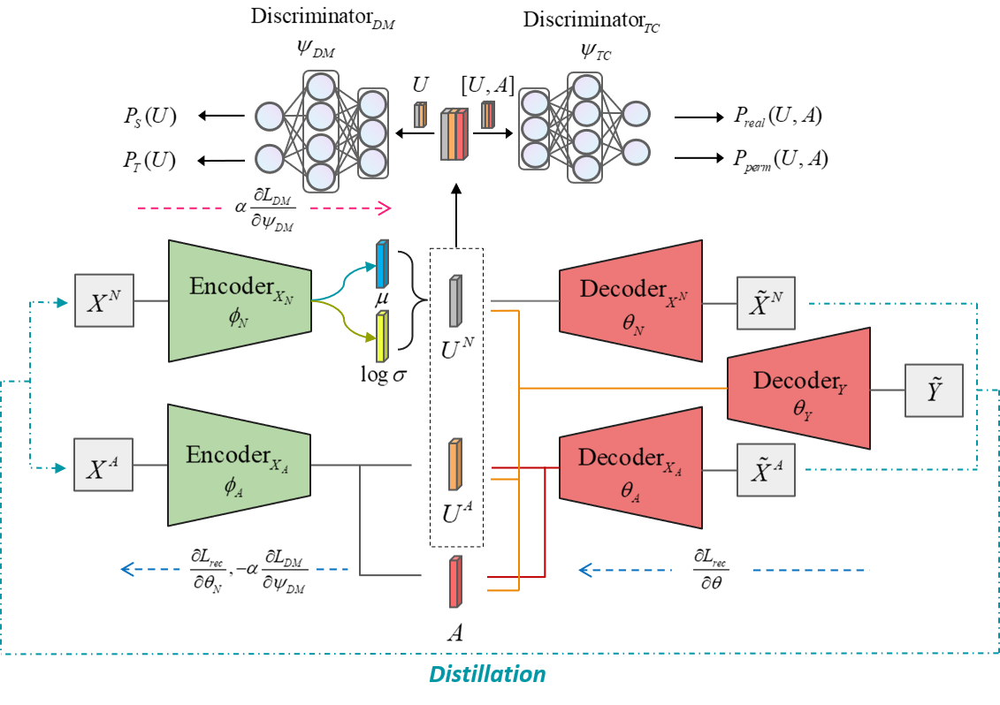

# CDVAE

[](https://github.com/XYiliang/CDVAE)

<p align="center">
    </img>
</p>

## Contents

- [About](#about)
- [Install](#install)
- [Usage](#usage)
- [Related_Work](#related_work)

## About <a name = "about"></a>

Pytorch Implemtentation of the Learning Counterfactualy Fair Representation under Covariate Shift via Distillation. We desiged a counterfactual fair representation learning framework called Causal Distillation Variational Autoencoder (CDVAE).

## Install <a name = "install"></a>

- Clone the repo
``` sh
git clone https://github.com/XYiliang/CDVAE.git
```

- Install Conda: please see https://docs.conda.io/en/latest/miniconda.html
- Create a New Conda env:

``` sh
conda create -f env.yaml
conda activate CDVAE
```
- Or Install the Packges in Any Current Environment:

```sh
conda activate your-env
conda install --yes --file requirements.txt
```

## Usage <a name = "usage"></a>

### Single Domain Predictive Experiments

For single domain predictive experiments we used 4 datasets:
 - synthetic
 - compas
 - law_school
 - adult

To do the single domain experiments, run with ```--task "pred_single"```. Change the ```--dataset``` to train on other datasets.

```
python run.py --task "pred_single" --dataset 'synthetic' --use_gpu "true" --gpu_ids "1"
```

For baseline compare:, run:
```
python run.py --task "pred_single_baseline" --dataset 'synthetic' --use_gpu "true" --gpu_ids "1"
```
Script in ```exp/predictive_baselines_single.py``` set the pretrained model saved in ```result/single_baseline_compare/dataset-name/pretrained```. Or run the single domain experiments several times, save the result models and do the baseline comparison with used them.


### Transfer Predictive Experiments

For transfer domain predictive experiments we used 4 datasets:
 - synthetic
 - compas
 - law_school
 - adult

To do the transfer domain experiments, run with ```--task "pred_transfer"```. Change the ```--dataset``` to train on other datasets.

```
python run.py --task "pred_transfer" --dataset 'synthetic' --use_gpu "true" --gpu_ids "1"
```

For baseline compare:, run:
```
python run.py --task "pred_transfer_baseline" --dataset 'synthetic' --use_gpu "true" --gpu_ids "1"
```
Script in ```exp/predictive_baselines_transfer.py``` set the pretrained model saved in ```result/transfer_baseline_compare/dataset-name/pretrained```. Or run the transfer domain experiments several times, save the result models and do the baseline comparison with used them.

### Generative Baselines

Generative baselines are CEVAE, mCEVAE, DCEVAE.

To run any of the baseline (e.g. DCEVAE):

```bash
cd baselines/generative/DCEVAE
python main.py
```

## Related Work <a name = "related_work"></a>

- DCEVAE: https://github.com/HyemiK1m/DCEVAE
- Counterfactual Fairness: https://github.com/mkusner/counterfactual-fairness
- Domain Adversatial Neural Network (DANN): https://github.com/fungtion/DANN
- folktables: https://github.com/socialfoundations/folktables

